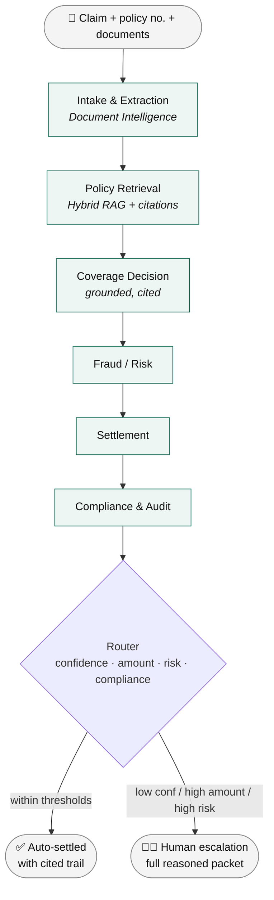

<div align="center">

# 🛡️ ClaimPilot

### Autonomous insurance claims adjudication, built with multi-agent GenAI

A claim comes in. A graph of specialist agents reads it, retrieves the governing policy, decides coverage, checks fraud and compliance, computes a settlement — then **auto-settles within thresholds or escalates to a human with a fully cited, auditable trail.**

[](https://github.com/alokranjan04/claimPilot/actions/workflows/ci.yml)


</div>

---

## What it does, in one look



Orchestrated as an **explicit LangGraph state machine** — the business logic lives in conditional edges, not buried in a prompt. Every node appends to an audit `trace`; every decision carries citations.

## Why it's interesting (engineering highlights)

| | |
|---|---|
| 🧠 **Justified multi-agent design** | Specialist agents (intake, policy-RAG, coverage, fraud, settlement, compliance) — each earns its place vs. a single-agent baseline. |
| 🔎 **Grounding made enforceable** | Hybrid (lexical + semantic) retrieval; a coverage decision with **zero citations is an invalid type** and can't be constructed. No source → escalate, never guess. |
| 🧩 **MCP tool servers** | Enterprise integrations exposed as Model Context Protocol servers — `policy_db`, `claims_history`, `fraud_signals`, `regs` — reusable across agents, authz at the boundary. |
| ✅ **Evaluation as a CI gate** | 10-case golden dataset; decision accuracy, citation faithfulness, escalation precision/recall, tool-call correctness **block merges on regression**. Evals are the test suite for non-deterministic software. |
| 🌐 **Full REST API** | FastAPI async surface: `POST /v1/claims`, `GET /v1/claims/{id}`, SSE `/stream`, `POST /v1/claims/{id}/decision`, `GET /v1/evals/latest`. Background worker + Checkpointer for pause/resume on escalation. |
| 📊 **Observability built in** | OTel-compatible spans per node, structured JSON logs (PII-stripped by processor), per-claim cost/latency summary on every API response. Provider-agnostic exporter interface (no-op default; Azure Monitor at M10). |
| 🔌 **Provider-agnostic core** | Core depends on interfaces; deterministic in-memory **fakes** run the whole system offline. Cloud is a config swap. |
| 🔐 **Security-by-default** | Entra ID, Private Endpoints, Content Safety, PII redaction, immutable audit trail. |
| 🧪 **Spec-driven & test-first** | Specs are the source of truth; strict typing + 205 tests gate every milestone. |

## Built with

**Python 3.12** · FastAPI · LangGraph · Pydantic v2 · MCP · Hybrid RAG
**Azure** — Azure OpenAI · AI Search · Document Intelligence · Container Apps · Service Bus · Cosmos DB
**Quality** — `uv` · `ruff` · `mypy --strict` · `pytest` · GitHub Actions (eval-gated)

## How it's built

- **Specs are the source of truth** → [`docs/specs/`](docs/specs/) (start with `00-master-spec.md`; Azure target in `10-deploy-azure.md`).
- **[`CLAUDE.md`](CLAUDE.md)** is the build contract — conventions, guardrails, definition of done.
- **[`docs/BUILD_PLAN.md`](docs/BUILD_PLAN.md)** — the milestone roadmap.
- **[`docs/SPEC_DRIVEN_WORKFLOW.md`](docs/SPEC_DRIVEN_WORKFLOW.md)** — the spec-driven dev loop.

## Quickstart (offline, no cloud, no keys)

```bash
uv sync --extra dev
make check                                  # ruff + mypy --strict + pytest
uv run uvicorn claimpilot.api.main:app --reload
curl -X POST localhost:8000/v1/claims -H 'content-type: application/json' \
     -d @tests/fixtures/sample_claim.json
```

Runs entirely on deterministic fakes — the full pipeline works before a single Azure credential is involved.

## Run on Azure (M10+)

```bash
uv sync --extra dev --extra azure
export PROVIDER=azure        # core code unchanged; providers swap behind interfaces
# Azure resource config via env / Key Vault — see docs/specs/10-deploy-azure.md
```

## Roadmap

Built milestone by milestone (see [`docs/BUILD_PLAN.md`](docs/BUILD_PLAN.md)):

- ✅ **M0** Skeleton & quality gate · ✅ **M1** Typed domain models · ✅ **M2** Provider interfaces + fakes
- ✅ **M3** LangGraph orchestration · ✅ **M4** RAG pipeline · ✅ **M5** Real agents · ✅ **M6** MCP servers
- ✅ **M7** Eval harness + CI gate · ✅ **M8** API + queue + checkpointing · ✅ **M9** Observability
- ⬜ **M10–M11** Azure providers + deploy

## License & data

Personal portfolio project. **Synthetic / public data only — no real PII.**

<div align="center">
<sub>Designed & built by <a href="https://linkedin.com/in/alokranjan04">Alok Ranjan</a> · AI Architect — Agentic AI, RAG & LLMOps</sub>
</div>
